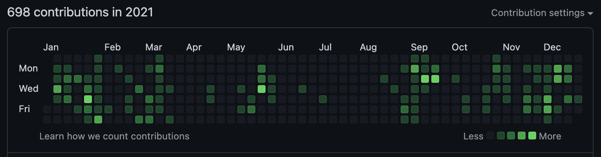
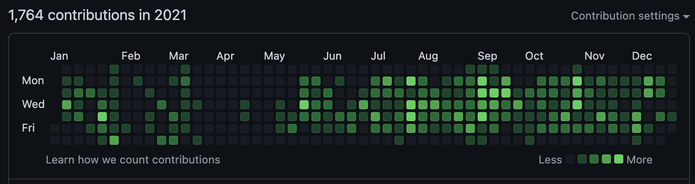

# Import GitHub Private Contribs

A program to import contributions from some GitHub account.

## Why is it needed?

I used the program to import to my profile contributions from [oredko-gd](https://github.com/oredko-gd). This is my HelloFresh work account that I had lost access.

Contributions before running `import-github-private-contribs`:



After:



## Getting Started

1. Download and install [Go 1.20](https://go.dev/dl/).
2. Install the program by running the command in a shell:
```shell
go install github.com/alexandear/import-github-private-contribs@latest
```

3. Run `import-github-private-contribs`:
```shell
import-github-private-contribs -token <github_token> -login <github_login> -fromDate <FROM_DATE> -toDate <TO_DATE> -committerName <NAME_SURNAME> -committerEmail <email@example.com>
```

where
- `token` is a personal access token for [GitHub account](https://docs.github.com/en/authentication/keeping-your-account-and-data-secure/creating-a-personal-access-token);
- `login` is any GitHub login from which you want to get contributions;
- `fromDate`, `toDate` are dates in format `YYYY-MM-DD` for limit contributions;
- `committerName`, `committerEmail` are git commit parameters for new commits.
